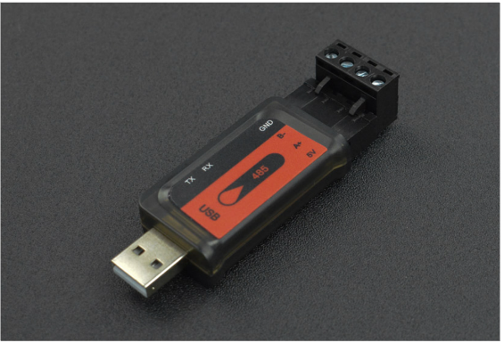

= Hardware

== Teileliste
Eine Auflistung aller Teile, welche im Produkt Cleanergy verbaut sind und NICHT von uns 3D gedruckt wurden, sondern gekauft sind finden Sie in diesem Unterkapitel
****
[cols="1,1,1,3" options="Header"]
|===
|Produkt|Link|Preis|Bild
|Arcade Button 24mm|link:https://www.play-zone.ch/de/arcade-button-24mm-rot.html[Link]|CHF 4.90|
|Big Dome Push Button 60mm (Grün)|link:https://www.play-zone.ch/de/big-dome-push-button-60mm-grun.html[Link]|CHF 8.90|
|Big Dome Push Button 60mm (Rot)|link:https://www.play-zone.ch/de/big-dome-push-button-60mm-rot.html[Link]|CHF 8.90|
|Big Dome Push Button 60mm (Blau)|link:https://www.play-zone.ch/de/big-dome-push-button-60mm-blau.html[Link]|CHF 8.90|
|Big Dome Push Button 60mm (Weiss)|link:https://www.play-zone.ch/de/big-dome-push-button-60mm-weiss.html[Link]|CHF 8.90|
|WS2813 Digital RGB LED 1 Meter|link:https://www.play-zone.ch/de/ws2813-digital-rgb-led-weatherproof-strip-30-led-1-meter.html[Link]|CHF 27.90|
|Lötkabel abisoliert und verzinnt 20 cm|link:https://www.play-zone.ch/de/5-x-4-20-stk-lotkabel-20cm-fertig-abisoliert-und-verzinnt.html[Link]|CHF 3.00|
|Anemometer|link:https://www.pi-shop.ch/rs485-wind-speed-transmitter[Link]|CHF 52.90|
|USB to RS485 Adapter|link:https://www.dfrobot.com/product-2189.html[Link]|CHF 8.90|
|Schaltnetzteil|link:https://www.bastelgarage.ch/5v-20a-ac-dc-100w-schaltnetzteil-s-100-5[Link]|CHF 29.50|
|Monitor LF24T450FQRXEN|link:https://www.brack.ch/samsung-monitor-lf24t450fqrxen-1166706?utm_source=google&utm_medium=cpc&utm_campaign=%21cc-pssh%21l-d%21e-g%21t-pla%21k1-it%21z-it_multimedia_channable&utm_term=&adgroup_id=95297775786&ad_type=pla&prod_id=1166706&campaign_id=9422718872&gclid=Cj0KCQiAsdKbBhDHARIsANJ6-jfRQGGQawB7UvCg2tagM_9FmxG4o9EdncPczdHkTnizpy8GE3a-YgsaAg7DEALw_wcB&hc_fcv=Y3S3WgKYAtRjnERa~MrGrKjU21k6I3U24zzzzzzzz~MrGrKi721ij-l-5-zzzzzzzz[Link]|CHF 149.00|
|Plexiglass 700mm x 700mm x 3mm|link:https://www.myplexiglas.ch[Link]|CHF 87.90|
|Spielbrett MDF Platte 5mm|https://www.jumbo.ch/de/bauen-renovieren/holz/holzplatten--holzzuschnitt/holzfaserplatten/mdf-platten/oecoplan-mdf-5-mm/p/3464347[Link]|CHF 15.95|
|Bodenplatte und Seitenwände 18mm|https://www.jumbo.ch/de/bauen-renovieren/holz/holzplatten--holzzuschnitt/massivholzplatten/massivholzplatten-1-und-3-schicht/massivholz-1-schicht-fichte-18mm/p/6722179?trackingtoken=product%7carea1%7cA%7cProduct%7cproduct_same_category_topseller%7cC2T_BO[Link]|CHF 74.95|
****

== Files
Alle Files der 3D Modelle, welche für unser Produkt verwendet werden, finden Sie als .stl Dateien in diesem Unterkapitel.

* link:stlFiles/Abdeckung_Links.stl[Abdeckung links]
* link:stlFiles/Abdeckung_Rechts.stl[Abdeckung rechts]
* link:stlFiles/Buttonhalterung.stl[Button Halterung]
* link:stlFiles/Figur_Standardsockel.stl[Spielfiguren Standardsockel]
* link:stlFiles/Figur_Erdwaerme_Haus.stl[Spielfigur Erdwärme (Haus)]
* link:stlFiles/Figur_Erdewaerme_Komplett.stl[Spielfigur Erdwärme (Komplett)]
* link:stlFiles/Figur_Solar_Panel.stl[Spielfigur Solarenergie (Panel)]
* link:stlFiles/Figur_Solar_Verbindung.stl[Spielfigur Solarenergie (Verbindung)]
* link:stlFiles/Figur_Solar_Komplett.stl[Spielfigur Solarenergie(Komplett)]
* link:stlFiles/Figur_Wasserkraft_Rad.stl[Spielfigur Wasserkraft (Wasserrad)]
* link:stlFiles/Figur_Wasserkraft_Sockel.stl[Spielfigur Wasserkraft (Sockel)]
* link:stlFiles/Figur_Wasserkraft_Verbindung.stl[Spielfigur Wasserkraft (Verbindung)]
* link:stlFiles/Figur_Windkraft_Windblaetter.stl[Spielfigur Windkraft (Windblätter)]
* link:stlFiles/Figur_Windkraft_Verbindung.stl[Spielfigur Windkraft (Verbindung)]
* link:stlFiles/Figur_Windkraft_Komplett.stl[Spielfigur Windkraft (Komplett)]
* link:stlFiles/Kabelführung_Links.stl[Kabelführung links]
* link:stlFiles/Kabelführung_Rechts.stl[Kabelführung rechts]

== Abmessungen
Die Holzkomponenten und ihre Abmessungen finden Sie in diesem Unterkapitel.

.Boden
image:images/Boden-1.png[Boden]

Kosten: CHF 15.60

.Rahmen
image:images/Rahmen-1.png[Rahmen]

Kosten: CHF 15.60

.Spielbrett
image:images/spielbrett.png[Spielbrett]

Kosten: CHF 15.60