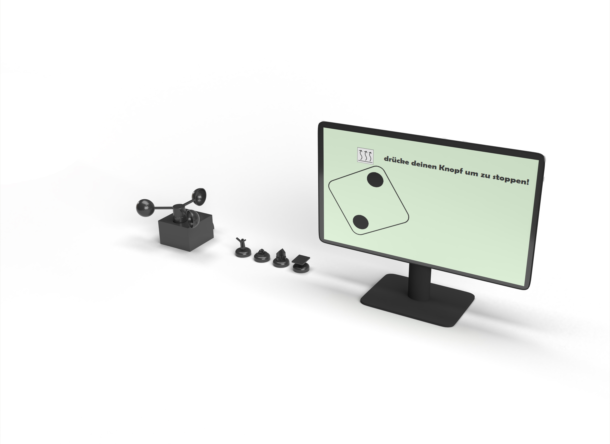

= Anleitungen

== Spiel transportieren
****
.Voraussetzungen:
* Das Spiel ist vollständig vorhanden
* Das Spiel wurde gemäss Anleitung "Spiel ausschalten" ausgeschaltet

1. Trennen Sie die Stromverbindung des Monitors sowie die Stromverbindung des Spielbretts.
2. Trennen Sie den Monitor von der HDMI Verbindung zum Spielbrett
3. Verstauen Sie die vier Spielfiguren separat.
4. Verstauen Sie den Monitor gut geschützt.
5. Falls notwendig, lösen Sie die Abdeckung über den Anemometer, trennen Sie das Kabel und lösen Sie die Schrauben um es abzunehmen. Anschliessend verstauen Sie es ebenfalls gut geschützt.
6. Das Spielbrett selber kann nun sicher verstaut werden und das gesamte Spiel ist transportbereit.

*Dies sind nebst dem Spielbrett, die zu transportierenden Komponenten.*

****

== Spiel einrichten
****
.Voraussetzungen:
Das Gesamte Spiel mit allen Komponenten (Spielbrett, Spielfiguren, Monitor, Anemometer) ist vor Ort vorhanden.

1. Einen genug grossen  Tisch vorbereiten für das Spielbrett und den Monitor.
2. Spielbrett darauf legen wobei das Brett so positioniert werden soll, dass der Bildschirm hinten ist und die Buttons vorne für einen guten Zugriff.
3. Spielfiguren in die dafür vorgesehenen Vertiefungen stellen.
4. Monitor an das herausragende HDMI Kabel einstecken, mit dem Stromkabel an eine Steckdose anschliessen und dann einschalten.
5. Spielbrett mit dem herausragenden Kabel am Strom (Steckdose) anschliessen.
****

== Spiel starten
****
.Voraussetzungen: +
Die Schritte aus dem Kapitel "Spiel einrichten" wurden erledigt und das Spielbrett sowie der Monitor sind miteinander und mit Strom verbunden.

1. Den kleinen roten Button auf der Rückseite drücken und warten bis der Startbildschirm auf dem Monitor erscheint. +
Wenn nichts passiert, die Stromversorgung und HDMI Verbindung zwischen Spielbrett und Monitor überprüfen und kontrollieren ob der korrekte Inputkanal auf dem Monitor gewählt wurde!

2. Sobald der Startbildschirm erscheint, ist das Spiel bereit zum Spielen. Es sind keine weiteren Schritte nötig.
****

== Spielabsturz
****
.Voraussetzungen:
* Entweder es ist ein unerwarteter Blackscreen/Freeze aufgetreten oder
* Es wird eine Fehlermeldung auf dem Bildschirm angezeigt

1. Wenn eine Fehlermeldung angezeigt wird, befolgen Sie die dort beschriebenen Anweisungen.
2. Wenn ein Blackscreen/Freeze aufgetreten ist, schalten Sie das Spiel mit dem kleinen roten Knopf auf der Rückseite aus und schalten Sie das Spiel mit demselben Button nach 30 Sekunden Wartezeit wieder ein.
3. Bleibt der Fehler bestehen, schalten Sie das Spiel erneut mit dem roten Knopf aus und trennen Sie es für rund eine minute vom Strom.

4. Starten Sie das Spiel erneut. Es sollte nun wieder einwandfrei funktionieren.
5. Wenn weiterhin ein Problem auftaucht, dann könnte es an der Hardware liegen. Wir empfehlen Ihnen in diesem Fall das Spielbrett zu öffnen (Siehe Anleitung weiter unten) und die Hardware zu überprüfen, ob ein Defekt vorhanden ist.
****

== Spielbrett öffnen
****
.Voraussetzungen:
* Das Spiel wurde gemäss Anleitung "Spiel ausschalten" ausgeschaltet
* Sie verfügen über einen Schraubenzieher mit einem passenden Aufsatz für die Schrauben des Spielbretts

1. Lösen Sie die vier Schrauben auf der Rückseite
2. Lösen Sie die Seitenwand
3. Sie sehen nun den Innenraum und haben vollen Zugriff auf die Elektronik

*Auf dem Bild ist das Element, welches herausgenommen werden kann, umrahmt und die Pfeile markieren die Positionen der zu lösenden Schrauben unten am Spielbrett.*

****

== Spiel ausschalten
****
.Voraussetzungen:
* Das Spiel ist mit dem Strom verbunden und befindet sich im Startbildschirm

1. Drücken Sie den roten Knopf auf der Rückseite des Spielbretts und warten Sie 20 Sekunden.

2. Das Spiel ist nun ausgeschaltet
****

== Verwendung des Codes
****
.Voraussetzungen:
Eine Java und JavaFX lauffähige Maschine bereitstellen inklusiv USB Port und PINS wo man Buttons anhängen kann.

1.	Code von dem Git-Repository auf die Hardware Klonen: https://gitlab.fhnw.ch/ip12-22vt/ip12-22vt_energieversorgung/game-master
2.	Im Kapitel Spielerbuttons muss man folgen wenn man Hardware Buttons einsetzen will. Sonst wird der User-Input jeweils über UI Buttons ersetzt.
3.	Nun muss man den Anemometer (Das Windmessgerät) neu Konfigurieren um auf der aktuellen Hardware problemfrei zu laufen. Genaue Spezifikation under dem Kapitel "Anemometer".
4.	Nun sollte die App bereit sein um normal via SuperApp.java#main mit Java zu starten.

****

== Spielerbuttons
****
.Voraussetzungen
Das Kapitel Verwendung des Codes wurde durchgelesen und die Schritte wurden ausgeführt.

-	Folgende Linie in App.java muss auskommentiert werden um nicht den Button-Emulator laufen zu lassen sondern tatsächlich die Inputs von den Buttons zu lesen. Die Linien mit dem EmulatorView können auch entfernt werden.
App.java#29
//PUI pui = new PUI(controller, Pi4J.newContext());

*Wichtig* +
App.java#43-48
Scene emulatorScene = new Scene(new EmulatorView(controller));
Stage secondaryStage = new Stage();
secondaryStage.setTitle("PUI Emulator");
secondaryStage.setScene(emulatorScene);
secondaryStage.show();

Man kann das Spiel auch mit dem EmulatorView spielen und einfach starten. Dann werden aber keine Inputs über die PINS gelesen.

-	Die Buttons die man auswählt werden über PINS angeschlossen. Die Input PINS werden in folgender Datei angepasst.
PUI.java#48
// Diese Linie 4x hinzufügen damit es für jeden Spieler einen Button hat.
playerButtons.add(new SimpleButton(pi4J, PIN.D22, false));

Folgende Linie in App.java muss auskommentiert werden um nicht den Button-Emulator laufen zu lassen sondern tatsächlich die Inputs von den Buttons zu lesen. Die Linien mit dem EmulatorView können auch entfernt werden.
App.java#29
//PUI pui = new PUI(controller, Pi4J.newContext());

App.java#43-48
Scene emulatorScene = new Scene(new EmulatorView(controller));
Stage secondaryStage = new Stage();
secondaryStage.setTitle("PUI Emulator");
secondaryStage.setScene(emulatorScene);
secondaryStage.show();

-	Jetzt muss sichergestellt sein, dass die Buttons korrekt an die Hardware mit PIN-Anschluss die Buttons korrekt angeschlossen sind. Dokumentation über die Verkabelung mit den Buttons ist je nach Hardware ein wenig unterschiedlich.
****

== Anemometer einrichten
****
1.	Ein Anemometer muss vorhanden sein mit Modbus-Kommunikationsprotokoll.
Eingebautes Model (Siehe Hardware Liste): +
https://www.pi-shop.ch/rs485-wind-speed-transmitter
Doku des Modells: +
https://wiki.dfrobot.com/RS485_Wind_Speed_Transmitter_SKU_SEN0483 +
Mit PIN zu USB-Adapter: https://www.dfrobot.com/product-2189.html
2.	Nun muss der USB-Port und die Modbus Konfiguration so angepasst werden um für das ausgewählte Modell zu funktionieren. Dies wird in der Datei Anemometer.java gemacht: +

Anemometer.java#15 +
params.setPortName("cu.usbserial-1220"); +
Anemometer.java#29 +
Register[] slaveResponse = master.readMultipleRegisters(2, 0, 1); +

*Hinweis* +
Falls es noch nicht so funktioniert wenn man den USB-Port angegeben hat und die zu lesenden Register angepasst hat, kann es sein das man weitere Hardware spezifische Modbus Konfiguration hinzufügen muss. Diese sind abhängig vom gewählten Modell. Wenn man unseres verwendet ist dies nicht nötig.

****

== Spracherweiterung

****
.Voraussetzungen:

Es wurde ein Branch erstellt um die Sprachfeatures zu implementieren.

1. Wir haben bereits begonnen das Gerüst für die Sprachfunktion zu legen
2. Jede weitere Sprache muss als JavaFX Bundle in den Ordner "bundles" hinzugefügt werden
3. Wo Text verwendet wird, muss der Key verwendet werden mit folgendem Befehl: +
lblField.setText(bundle.getString("key1"));

*Hinweis:* +
In JavaFX wird der Key jeweils so ausgelesen: <Label text="%key2"/> +

*Helplink:* +
https://stackoverflow.com/questions/10143392/javafx-2-and-internationalization
****
