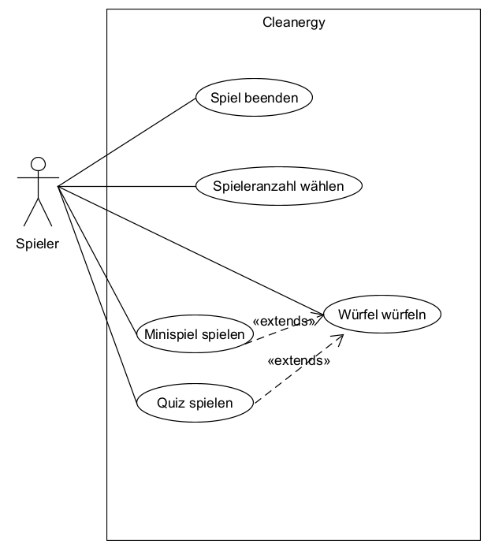

[[section-introduction-and-goals]]
== Einführung und Ziele
Dieses Kapitel führt in die Aufgabenstellung ein und beschreibt die verschiedenen Anforderungen sowie Stakeholder an das Projekt.

=== Aufgabenstellung

****
Im Rahmen der IP12 Projektschiene an der Hochschule für Technik der FHNW, entwerfen und bauen wir, Team Cleanergy, ein Spielbrett mit physischen sowie digitalen Elementen.
Die physischen Elemente beinhalten ein Spielbrett aus Holz inklusive Spielfiguren und ein Anemometer.
Die digitalen Elemente sind ein Gamemaster, der die Spieler durch die Spielrunden führt und Minigames sowie ein digitaler Würfel.
Das Ziel des Spiels ist es, Sekundarschülern erneuerbaren Energien spielerisch näherzubringen und diese untereinander zu vergleichen.

Der Auftraggeber, Primeo Energie, hat uns die Rahmenbedingungen vorgegeben, welche wir in Zusammenarbeit mit unseren Kunden erarbeiten und vertiefen.
Diese Aufgabenstellung findet sich im unter folgendem https://fhnw365.sharepoint.com/teams/w-22_efw_sgi_m365/Freigegebene%20Dokumente/Forms/AllItems.aspx?id=%2Fteams%2Fw%2D22%5Fefw%5Fsgi%5Fm365%2FFreigegebene%20Dokumente%2FGeneral%2FProjekt1%5FVorbereitung%2FProjektbeschreibungen%2FIP12%2D22vt%5FEnergieversorgung%2Epdf&parent=%2Fteams%2Fw%2D22%5Fefw%5Fsgi%5Fm365%2FFreigegebene%20Dokumente%2FGeneral%2FProjekt1%5FVorbereitung%2FProjektbeschreibungen[Link].

Zur Verständnishilfe dient das nachfolgende Use Case Diagramm:

****

=== Funktionale Anforderungen

****
[cols="1,1,2" options="header"]
|===
|Anforderung |Kriterien |Prüfkriterien
| Physische Elemente |Spiel muss eine oder mehrere physische Komponenten enthalten  | Prüfen, ob physische Komponenten vorhanden und Absprache mit Kunden, welche Komponenten er wünscht.
| Erneuerbare Energien miteinander vergleichen mit Lerneffekt|Im Spiel muss der Vergleich von erneuerbaren Energien passieren und es soll ein lerneffekt entstehen  | User Testing mit anschliessendem Feedback soll zeigen, ob die Spieler etwas gelernt haben. Das Spiel soll das Wissen bereitstellen und "überprüfen" durch Faktenchecks und kleine Quizfragen
| Verschiedene Spieleranzahlen unterstützen | Das Spiel muss eine Spieleranzahl von 2 bis 4 Spielern unterstützen  | User Testing mit 2, 3 und 4 Spielern um sicherzustellen, dass der Spielablauf in jedem Fall reibungslos verläuft
| Eindeutiger Sieger nach Spielende | Das Spiel endet, wenn ein eindeutiger Sieger feststeht und durch das System bekannt gegeben wird | Usability tests durchführen. Wird wirklich ein Sieger bekanntgegeben und endet das Spiel dann für alle Spieler sichtbar?
|===
****

=== Nicht-funktionale Anforderungen

****
[cols="1,1,2" options="header"]
|===
|Anforderung |Kriterien|Prüfkriterien
|Benutzerfreundlich |Einfache und intuitive Bedienung, einfach verständliche Spielregeln und Ablauf |Usability tests mit der Zielgruppe durchführen. Anschliessend durch Fragebogen Fragen zur Benutzerfreundlichkeit stellen (Einfache Bedienung, verständliche  Spielregeln, logischer Spielablauf) durch Auswertung ist ableitbar, ob erfüllt oder nicht.
|Langlebig| Der physische Teil soll langlebig gebaut sein, damit es von Primeo längerfristig ausgestellt werden kann|Durchführung Belastungstests, also Verwendung von Anemometer, Bewegen von Spielfiguren und drücken der Buttons. Stösse ans Spielbrett testen sowie auch langlebigkeit der Deko, die auf dem Brett klebt.
|Zuverlässig|Ein- und Ausschalten, Spielstart, korrekte Spielzüge, saubere Gewinnerermittlung, korrekter Spielablauf, Bonuswürfel anzeigen, Zonenübertritte |TestCases und Usability Tests
|Wartbar|Gut strukturierter Code der  dokumentiert und leicht verständlich ist um zukünftige Anpassungen oder Bugfixing zu ermöglichen |Einhaltung der Code-conventions überwachen, Code reviews vor merges durch ein anderes Teammitglied um zu sehen, ob der Code auch verständlich ist, Anleitungen bereitstellen mit Hinweisen und Tipps um Anpassungen möglichst leicht vornehmen zu können.
|Spielbalance |Spiel soll ausgeglichen und fair sein damit alle Teilnehmer unabhängig von ihrem spielerischen können ein positives Spielerlebnis haben| Befragung Zielgruppe nach Usability Tests. Ebenfalls Spiel bei verschiedenen Anzahlen von Spielern durchspielen um zu prüfen, ob es sich immer fair anfühlt zu spielen.
|===

Die Qualitätsszenarien in Kapitel 10 konkretisieren diese Qualitätsanforderungen und dienen dazu, die Erreichung zu bewerten.
****

=== Stakeholder

****
[cols="1,1,2" options="header"]
|===
|Rolle |Kontakt |Erwartungshaltung
| Kunden | katja.pott@fhnw.ch, cedric.merz@fhnw.ch | Das Spiel (System) sollte die angegebenen Anforderungen erfüllen.
|Team| joel.hauri@students.fhnw.ch| Termingerechte Fertigstellung des Produkts unter Einhaltung der definierten Anforderungen
| Zielgruppe | Sekundarschüler | Spiel (System) soll Spass machen und benutzerfreundlich sein
| FHNW | louispaul.wicki@fhnw.ch | Spiel (System) soll ein Raspberry PI verwenden, Budget nicht überschreiten und innerhalb der vorgegebenen Zeit fertiggestellt werden
|===
****
