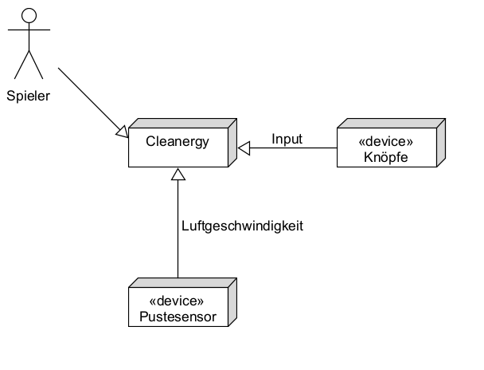
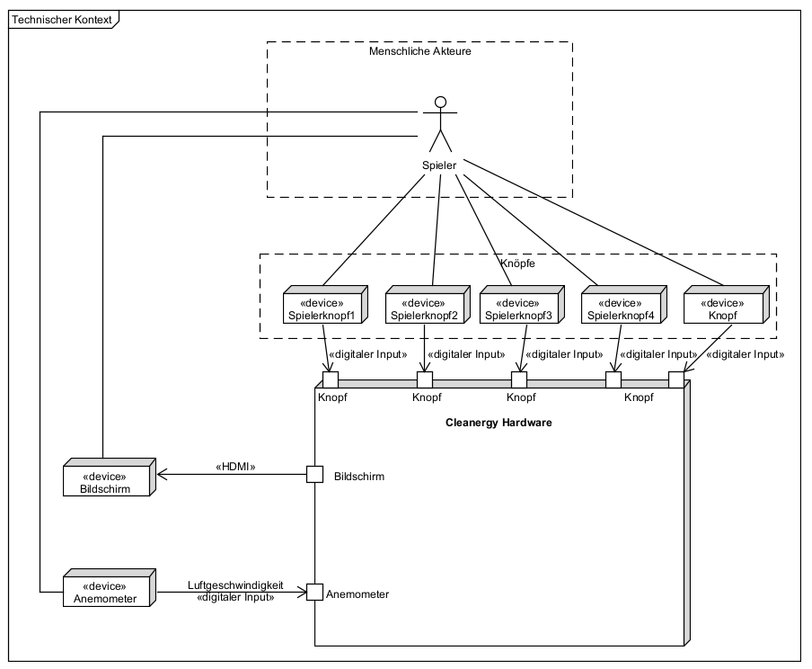

[[section-system-scope-and-context]]
== Kontextabgrenzung
Dieses Kapitel beschreibt die Abgrenzungen des Systems und erklärt die Interaktionsmöglichkeiten sowie Schnittstellen.

=== Fachlicher Kontext

****

*System (Cleanergy)* +
Das System selber stellt zu Beginn die Spielregeln vor und führt durch das Spielerlebnis.
Es definiert einen Gewinner am Ende des Spiels.

*Spieler* +
Das Cleanergy Brettspiel wird von zwei bis vier Spielern gespielt, welche gegeneinander antreten.
Das System Cleanergy übernimmt in Form eines Gamemasters die Rolle des Spielführers und leitet die Spieler durch die Runden, welche aus verschiedenen Aktivitäten bestehen (Würfeln, Minigames, Quiz und Faktechecks).

*Anemometer (Pustesensor)* +
Der Pustesensor wird ebenfalls durch das Brettspiel zur Verfügung gestellt und über das Cleanergy System gesteuert.
Die Spieler interagieren im Rahmen eines Minigames damit.

*Buttons* +
Die Buttons werden aussen am Spielbrett befestigt und sind vier an der Zahl.
Jedem Spieler wird zu Beginn des Spiels ein Button zugewiesen mit dem er im Spiel interagieren wird.
Bis auf das Minigame mit dem Anemometer, finden ALLE interaktionen über die Buttons statt

*Use Case Diagramm zur vereinfachten Veranschaulichung*

****

=== Technischer Kontext

****

*Buttons* +
Es werden fünf Spielbuttons an das Raspberry PI angeschlossen. Die Spieler interagieren mit vier dieser Buttons mit dem Spiel. Jedem Spieler wird zu Beginn ein Button zugeordnet. Der fünfte Button dient zum Spielstart, Restart sowie zum Ausschalten.

*Bildschirm* +
Der Bildschirm wird via HDMI an das Raspberry PI angeschlossen und zeigt den graphischen Output des Spiels. Die Spieler sehen über den Bildschirm jegliche Anweisungen sowie die Minigames.

*Anemometer* +
Das Anemomter wird über die J2Mod library von der Cleanergy Software gesteuert und ist via USB direkt mit dem Raspberry PI verbunden. Die Spieler interagieren im Rahmen eines Minigames mit dem Anemomter. Es liefert Windgeschwindkeiten als digitalen Input an das Cleanergy System. +
Basierend auf Rücksprache mit dem Kunden, wird auf eine Messbegrenzung zur Einschränkung des Schummelns verzichtet.

*Spielfiguren* +
Den Spielern steht je eine phyische Spielfigur zur Verfügung, welche sie über das Spielbrett bewegen, bis eine Figur das Ziel erreicht. Diese Figuren verfügungen über KEINEN integrierten Chip +
Basierend auf Rücksprache mit den Kunden wird auf ein Tracken der Spielerpositionen verzichtet.

*LED Streifen* +
Die LED streifen werden an das Raspberry PI angeschlossen und beleuchten die Spielbrettlöcher. Sie können einzeln angesteuert werden, um so die Position der Figuren für die Spieler zu visualisieren.

*Stromanschluss* +
Die Hardware, also das Raspberry Pi wird via Kabel an den Strom angeschlossen. Das Raspberry PI versorgt alle Hardwarekomponenten mit Strom.

****
