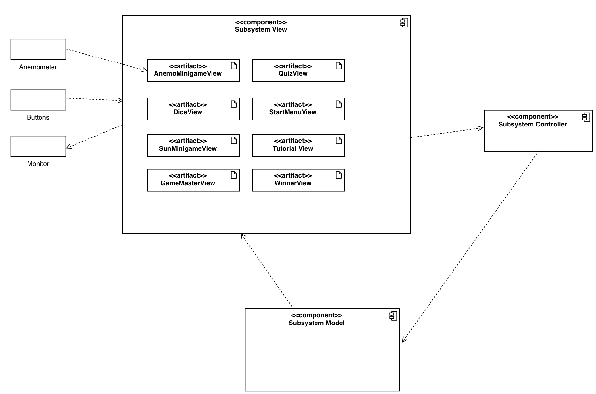

[[section-building-block-view]]
== Bausteinsicht

Dieses Kapitel beschreibt die Zerlegung der Software von Cleanergy in einzelne Bausteine. +
Es werden die Kontextabgrenzung und drei tiefere Ebenen gezeigt.

=== Kontextabgrenzung

****
Das System Cleanergy ist ein eigenständiges System ohne verbindungen zu anderen Nachbarsystemen.
Es ist mit Inputgeräten (Buttons und Sensor) verbunden sowie mit einer Ausgabe. +
Interaktionen finden durch die Spieler statt.

****

=== Ebene 1

****
Die Erste Ebene beschreibt die Whitebox des Gesamtsystems.
Es wird das MVC Model verwendet.
Entsprechend ist unserer Subsystemzerlegung nach View, Model und Controller, dies sind in Ebene 1 entsprechend die Blackboxes.
Die Schnittstellen Anemometer, Buttons und Bildschirm werden ebenfalls hier dargestellt.

Die Zerlegung orientiert sich an der Vorlage und Empfehlung der https://github.com/Pi4J/pi4j-template-javafx[FHNW].
****

==== Blackbox View

****

Alle relevanten Eingaben werden zum Controller geschickt für die weitere Verarbeitung. +
Ist Verbunden mit allen Schnittstellen zwischen dem System und den Benutzern, also die Buttons, Sensoren (Anemometer) und Ausgaben (Bildschirm und LED Lichter).
Die Beschreibung zu den Schnittstellen finden Sie weiter unten im Unterkapitel Schnittstellen auf Ebene 1. +
Die View liest Daten vom Model ab und gibt diese dann aus. +
Die View ist für die funktionale Anforderung "physische Elemente" verantwortlich, da diese dort angeschlossen sind.
****

==== Blackbox Controller

****

Der Controller nimmt die Eingaben von der View entgegen und kommuniziert diese mit dem Model. +
Der Controller leitet den Spielablauf und startet alle relevanten Minigames. +
Er wird umgangssprachlich intern auch "Gamemaster" genannt, da er den Spielablauf leitet und die Benutzer durch das Spiel führt.
****

==== Blackbox Model

****

Speichert laufend alle Spieldaten (Spielrunden, Spieleranzahl, Positionen). +
Ebenfalls befindet sich die komplette Logik des Spiels dort. +
Das Model ist für die funktionale Anforderung zuständig, am Ende einen Gewinner auszugeben und ermöglicht die funktionale Anforderung verschiedener Spieleranzahlen.
****

==== Schnittstellen

****

[cols="1,2" options="header"]
|===
|Schnittstelle|Beschreibung
|Buttons|Die zentrale Interaktionsmöglichkeit für die Benutzer. Die Eingaben werden direkt an die View weitergeleitet. Werden für jegliche Aktionen im Spiel verwendet.
|Anemometer|Der Sensor für ein Minigame. Wenn das Minigame aktiv ist, werden die Inputs (Drehgeschwindigkeit) an die View gesendet.
|Bildschirm|Die Ausgabeschnittstelle des gesamten Systems. Alle Informationen und Minigames werden dort ausgegeben via der View.
****

=== Ebene 2

****
Die zweite Ebene beschreibt die Whiteboxen der drei einzelnen Subsysteme View, Model und Controller
****

==== Whitebox View

****

Hier befinden sich alle Views, entsprechend für jeden Gamestate. +
Ebenfalls sind die Schnittstellen hier verknüpft. +
Entsprechend befinden sich hier alle FXML Bestandteile für die Ausgabe auf dem Bildschirm.
****

==== Whitebox Controller

****

Beherbergt alle Methoden im Zusammenhang mit den einzelnen States des Spiels. +
Basierend auf den Angaben aus dem Model werden hier die Minigames und Würfelrunden gestartet und alles gesteuert.
****

====  Whitebox Model

****

Hier befindet sich die Logik der Minigames, welche auch als Blackboxes auf dem Diagramm erkennbar sind. +
Ebenfalls ist hier die Logik des Würfels, Gamemasters und weiteren Klassen.
****

=== Ebene 3

==== Whitebox Anemometer (Model)

****

Die Logik des Anemometers befindet sich hier. +
Entsprechend sind die Methoden für die Initialisierung, wenn eine Runde startet hier programmiert. +
Ebenfalls wird hier die zentrale Methode zur Messung der Geschwindkeit beherbergt und kann dann entsprechend aufgerufen werden.
****

==== Whitebox Dice (Model)

****

Die Logik des Würfels befindet sich hier. +
Entsprechend ist die Methode zum würfeln hier implementiert. +
Durch die Attribute Min und Max werden die möglichen Zahlen die gewürfelt werden können bestimmt.
****