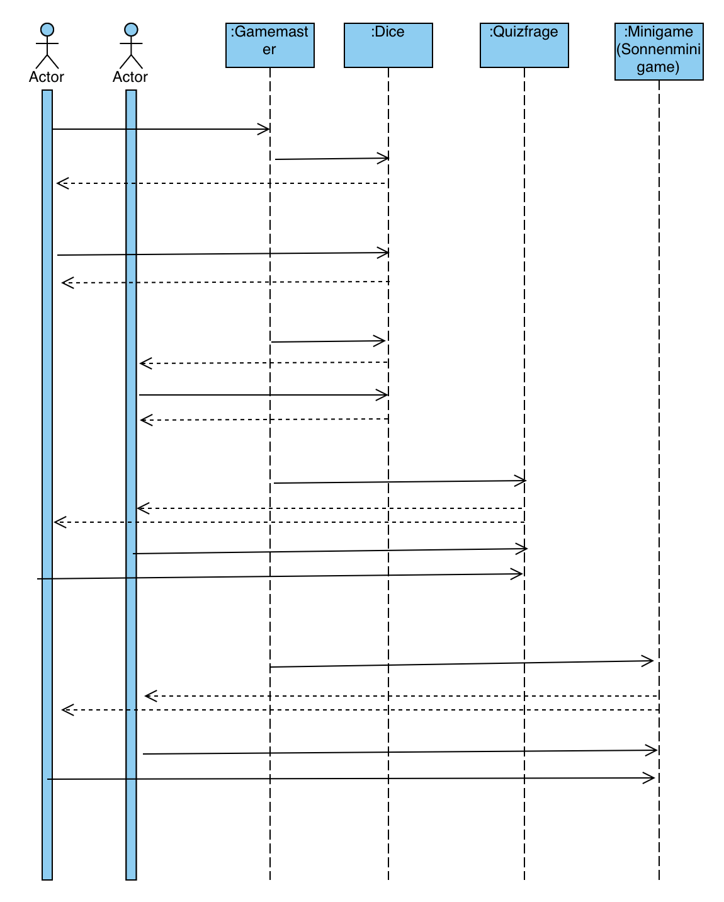

[[section-runtime-view]]
== Laufzeitsicht
Dieses Kapitel stellt das wichtigste Szenario als Sequenzdiagramm dar. +
Das Szenario repräsentiert den Spielablauf mit allen darin enthaltenen Etappen und Regeln.

=== Szenario Spielablauf
****
Das nachfolgende Sequenzdiagramm zeigt einen Klassischen Ablauf des Spiels Cleanergy mit zwei Spielern. Dieser Ablauf wiederholt sich so lange, bis ein Spieler das Ziel erreicht hat.

****