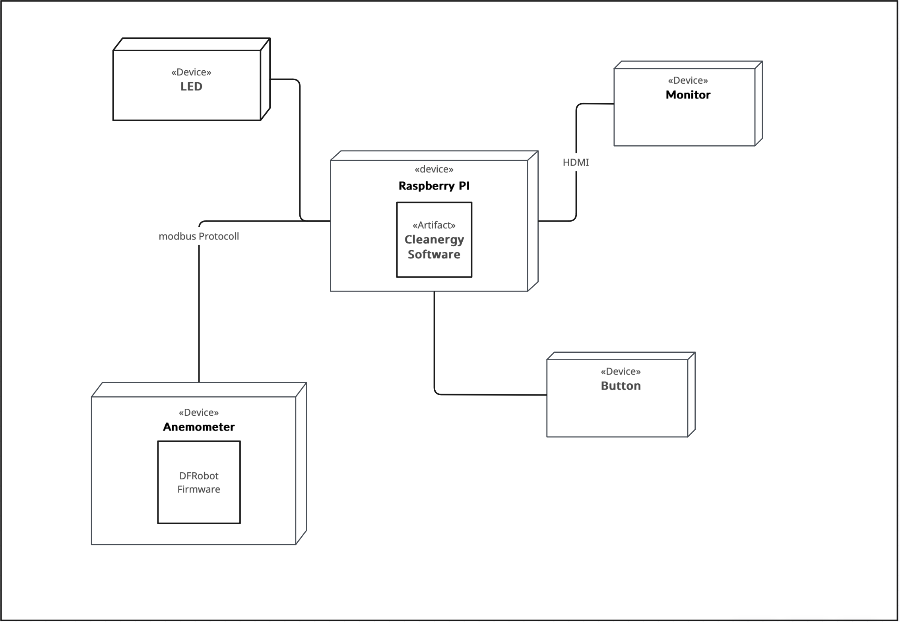
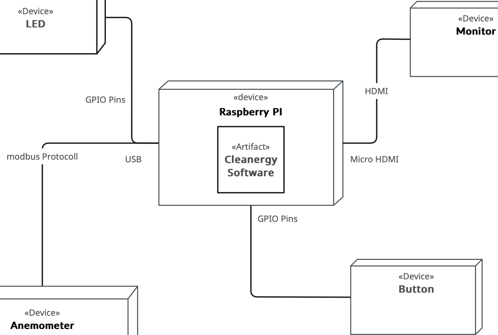
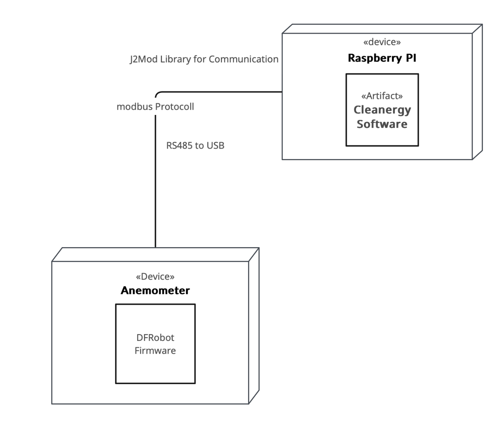

[[section-deployment-view]]
== Verteilungssicht
Dieses Kapitel stellt die Infrastruktur auf zwei Ebenen dar. +
Auf Ebene 1 die Gesamtübersicht und auf Ebene 2 zwei Infrastrukturelemente vertieft.

=== Infrastruktur Ebene 1
****

* Das RaspberryPI wird innerhalb vom Spielbrett platziert, genau wie die übrige Elektronik. +
* Es besteht/benötigt keine Verbindung mit dem Internet ausser man verbindet sich mit dem Raspberry PI. +
* Die Stromzufuhr wird über das Raspberry PI geregelt. +
* Auf dem Raspberry PI werden die gängigen Pins verwendet. Man kann somit das Raspberry PI jederzeit austauschen und die Software übertragen.
****

=== Infrastruktur Ebene 2

==== Raspberry PI
****

* Das Raspberry PI übernimmt die Kontrolle in der Gesamtstruktur. +
* Jedes Device ist ausschliesslich mit dem Raspberry PI verbunden!
* Die Verbindungen erfolgen über die GPIO Pins, USB und Micro HDMI +
* Das Raspberry PI ist mit dem Strom verbunden und versorgt auch alle angeschlossenen Elemente damit. +
* Auf dem Raspberry PI läuft die eigentliche Cleanergy Software für das Spiel. +
* Das Raspberry PI kann angesteuert werden, um die darauf vorhandene Software anzupassen oder neue hochzuladen. Somit lässt sich das Raspberry PI bei einem Schadensfall auch problemlos austauschen, wenn man die Software vorher als Backup speichert. Einfach neues RaspberryPI mit den Elementen verbinden und die Software hochladen.
****

==== Anemometer
****

* Das Anemometer verfügt über ein RS485 Kabel und hängt via RS485 zu USB Adapter am Raspberry PI
* Das Anemometer ist ein elektronisches und verfügt über eine integrierte Firmware von der Firma DFRobot welches die gemessenen Daten aufbereitet
* Die Kommunikation mit dem Raspberry PI und somit mit der Cleanergy Software läuft über das modbus Protokoll.
* Die Cleanergy Software auf dem Raspberry PI verwendet eine Java Library (j2mod) um via modbus mit dem Anemometer zu kommunizieren und die Daten zu empfangen
****
