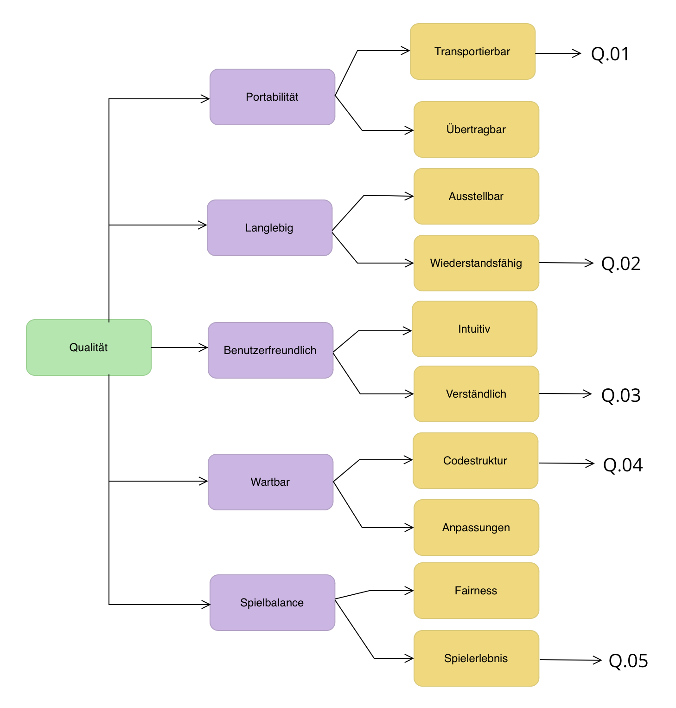

[[section-quality-scenarios]]
== Qualitätsanforderungen
Dieses Kapitel beinhaltet konkrete Qualitätsszenarien, welche die zentralen Qualitätsziele, aber auch andere geforderte Qualitätseigenschaften besser fassen.

=== Qualitätsbaum
****

****

=== Qualitätsszenarien
****
[cols="1,1,2" options="header"]
|===
|Nummer|Qualitätsszenario|Beschreibung
|Q.01|Spielbrett transportieren|Wenn das Spielbrett im Rahmen der Primeo Ausstellung transportiert wird, soll es nicht kaputt gehen und entsprechend von der Grösse her einen möglichst einfachen Transport ermöglichen. Primeo soll das Spielbrett einfach einladen und verschieben können, ohne es auseinander zu  bauen.
|Q.02|Wiederstandfähiges Spielbrett|Das Spielbrett wird an der Ausstellung täglich durch die Zielgruppe gespielt. Entsprechend wird es ein gewisses Mass an Abnutzung geben über die Monate. Wenn ein Jugendlicher an das Spielbrett knallt beim Spielen soll es nicht direkt kaputt gehen sondern leichten bis mittleren Erschütterungen Standhalten. Die Spielfiguren können auch mal auf den Boden fallen und sollen in diesem Fall nicht kaputt gehen.
|Q.03|Verständliche Spielregeln|Die Spieler sehen die Anleitung zum Spiel am Anfang. Sie sollen direkt verstehen wie das Spiel funktioniert, was das Ziel ist und was sie tun müssen um zu gewinnen.
|Q.04|Gut strukturierter Code|Wenn Primeo das Spiel erweitern möchte oder einen Bug fixen will, soll dies möglichst einfach von statten gehen, indem wir eine klare und verständliche Codestruktur wählen und ebenfalls soll Primeo durch Anleitungen unterstützt werden.
|Q.05|Positives Spielerlebnis|Die Spieler haben das Spiel beendet und es wurde ein Gewinner bekanntgegeben. Für die Jugendlichen soll nun das Spiel als positives und lustiges Spielerlebnis im Kopf bleiben.
****